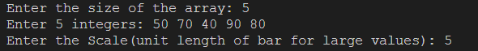
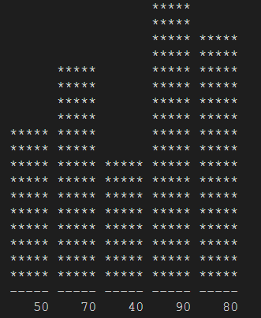

# Histogram Generator Library




The Histogram Generator Library is a C library that empowers you to create histograms from arrays of integers effortlessly. With this library, you can customize the width of each bar and even scale down larger values for optimal visualization. Visualize your data in a meaningful and insightful way.

## Table of Contents

- [Features](#features)
- [Getting Started](#getting-started)
- [Usage](#usage)
- [Customization](#customization)
- [Contributing](#contributing)
- [License](#license)

## Features

- **Customizable Histograms:** Tailor the appearance of your histograms by adjusting the width of individual bars.
- **Scaling Options:** Scale down larger values for improved visualization.
- **User-Friendly Interface:** Simplify the process of generating histograms from integer arrays.
- **Cross-Platform:** The library is designed for cross-platform use, making it suitable for various operating systems.

## Getting Started

### Clone the Repository

Begin by cloning this repository to your local machine:

```bash
git clone https://github.com/priyans-hu/Histogram-in-C.git
cd Histogram-in-C
```
## Include the Library

Place the `histogram_generator.h` header file in your project directory.

## Include the Header

Include the histogram_generator.h header at the beginning of your C code file where you intend to use the library:

```bash
#include "histogram_generator.h"
```

## Generate a Histogram

To utilize the library's powerful functionality, call the generateHistogram function within your code (usually within the main function):

```bash
int arr[] = {10, 25, 50, 75, 100};
int size = sizeof(arr) / sizeof(arr[0]);
int barWidth = 5; // Adjust the width of each bar
int scale = 10;   // Adjust the scale (unit size of bars) for larger values

generateHistogram(arr, size, barWidth, scale);
```


## Customization

You can customize the appearance and scale of your histograms to suit your specific needs. Experiment with different bar widths and scales to achieve the perfect visualization for your data.

## Contributing

Contributions to this project are welcome! If you'd like to contribute, please follow these guidelines:

Fork the repository.
- Create a new branch: git checkout -b feature/your-feature-name.
- Make your changes and commit them: git commit -m 'Add some feature'.
- Push to the branch: git push origin feature/your-feature-name.
- Open a pull request to the main branch of this repository.

 ## License

 This library is licensed under the [MIT License](LICENSE).
